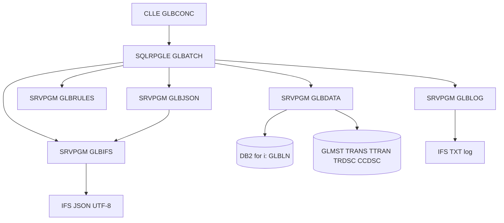

# Taller IBM i - Conciliación de Cuentas Mayores con SDD (Spec Driven Development)

## Resumen Ejecutivo

* **Problema resuelto:** Los procesos de cierre contable y conciliación financiera en sistemas legados IBM i a menudo sufren de falta de trazabilidad, procesos monolíticos acoplados y salidas difíciles de consumir por sistemas modernos. Este proyecto resuelve la necesidad de extraer, conciliar y reportar la información financiera de saldos contables en la tabla principal `GLBLN`, comparándolos contra transacciones detalladas e informando discrepancias a través de un canal estandarizado en formato JSON y una bitácora operativa en formato de texto.
* **Objetivo del proyecto:** Construir una solución por lotes (batch) altamente modular y desacoplada bajo la metodología SDD (Spec Driven Development) en la plataforma IBM i. La solución debe garantizar integridad de datos, validación formal de los archivos de salida, controles de cuadratura globales y registros detallados de incidentes para auditoría.
* **Resultado esperado:** La generación automática de un archivo JSON estructurado (en codificación UTF-8) y una bitácora operativa en formato TXT (`.log`) en un directorio parametrizable del IFS, catalogando el resultado final de la corrida como `FINALIZADO`, `PARCIAL` o `ERROR` de acuerdo con la severidad de las incidencias financieras o técnicas encontradas.

## Alcance Funcional

* **Qué hace:**
  * Consulta cuentas mayores de saldos en la tabla principal `GLBLN` utilizando filtros de ejecución configurables (banco, sucursal, moneda, rango de cuentas y fecha de corte).
  * Enriquece las cuentas de forma dinámica con descripciones, naturaleza y nivel de cuenta desde `GLMST` y centros de costo desde `CCDSC` utilizando la vista de contexto `V_GLBLN_CTX`.
  * Consolida y unifica movimientos contables históricos de `TRANS` y del día de `TTRAN` a través de la vista normalizada `V_GL_MOVS`.
  * Calcula de forma comparativa los saldos esperados por cuenta contable sumando débitos y restando créditos al saldo inicial, determinando la diferencia neta respecto al saldo reportado.
  * Evalúa desviaciones contra un umbral de tolerancia global parametrizable, marcando las cuentas que exceden la tolerancia (`excedeTolerancia`) e indicando si requieren revisión manual (`requiereRevision`).
  * Asigna estados financieros (`NORMAL`, `OBSERVADO`, `CRITICO`) y estados de conciliación (`CONCILIADA`, `PARCIAL`, `NO_CONCILIADA`, `NO_PROCESADA`) individuales.
  * Agrega secciones de control global de cuadratura (`controlTotales`) y un listado de incidentes funcionales o de datos detectados para auditoría.
  * Escribe la salida en el IFS de manera atómica (mediante un archivo temporal que se renombra solo al finalizar con éxito) y codificada en UTF-8.
  * Genera una bitácora operativa TXT estructurada con un formato estandarizado de trazabilidad.
  * Valida la sintaxis del JSON final y la consistencia de los totales calculados antes de la publicación final.
* **Qué no hace:**
  * No incluye interfaces gráficas de usuario (aplicaciones web, móviles o pantallas tradicionales 5250).
  * No realiza integraciones en tiempo real u síncronas con sistemas bancarios externos (es un proceso batch).
  * No modifica la estructura física de las tablas fuente de producción (`GLBLN`, `GLMST`, etc.).
  * No utiliza ni crea objetos tradicionales DDS de IBM i como Archivos Físicos (PF) o Archivos Lógicos (LF); toda la base de datos se maneja bajo el estándar SQL DDL (tablas y vistas).

## Arquitectura General

La solución se ha diseñado bajo los principios de modularidad, alta cohesión y bajo acoplamiento (SOLID), separando las capas de presentación batch, orquestación del proceso, acceso a datos, lógica de negocio, formato de salida y persistencia en el IFS.



### Componentes de la Solución

* **Programa Principal (`GLBCONC` - CLLE):** Sirve como interfaz de entrada para el flujo batch, valida la presencia de los parámetros obligatorios y prepara la lista de bibliotecas (`*LIBL`) antes de llamar al orquestador RPGLE.
* **Orquestador Principal (`GLBATCH` - SQLRPGLE):** Coordina todo el ciclo de vida de la ejecución. Genera el identificador único (`idEjecucion`), inicializa el log, valida la parametrización de negocio, maneja la lectura del cursor de cuentas, invoca el cálculo de reglas, acumula totales y delega la escritura del JSON y la bitácora física.
* **Acceso a Datos (`GLBDATA` - Service Program / SQLRPGLE):** Encapsula el acceso físico a DB2 for i. Abre y recorre cursores utilizando la vista de contexto `V_GLBLN_CTX` y recupera movimientos normalizados desde `V_GL_MOVS` y descripciones desde `TRDSC`. No contiene lógica de negocio.
* **Reglas de Negocio (`GLBRULES` - Service Program / RPGLE):** Módulo puro que procesa los cálculos matemáticos (diferencias, totales), evalúa el umbral de tolerancia, clasifica el estado financiero y de conciliación e identifica los códigos de incidente aplicables por cuenta. No accede a la base de datos ni interactúa con archivos externos.
* **Generación JSON (`GLBJSON` - Service Program / SQLRPGLE):** Construye el documento de salida estructurado mediante funciones nativas de Db2 for i (`JSON_OBJECT`, `JSON_ARRAYAGG`, `FORMAT JSON`). También implementa rutinas para validar sintácticamente el JSON resultante usando `JSON_TABLE` y verificar el cuadre de totales agregados.
* **Acceso a IFS (`GLBIFS` - Service Program / SQLRPGLE):** Valida las rutas y gestiona la escritura física atómica en el IFS en codificación UTF-8 utilizando la utilidad del sistema `QSYS2.IFS_WRITE_UTF8`.
* **Bitácora y Auditoría (`GLBLOG` - Service Program / SQLRPGLE):** Registra eventos secuenciales y técnicos en un archivo plano en el IFS, formateado con la estructura normalizada: `timestamp|idEjecucion|etapa|severidad|codigo|mensaje`.
* **Componentes de Pruebas:** Compuesto por seis programas de servicio (`TSTRULES`, `TSTDATA`, `TSTJSON`, `TSTIFS`, `TSTLOG`, `TSTBATCH`) que exportan los 24 casos existentes, scripts SQL de aserción (`ASSERT_JSON.sql`, `ASSERT_TOTALES.sql`) y el orquestador RPGLE `RUNTST`.

## Tecnologías Utilizadas

| Tecnología | Uso |
| ---------- | --- |
| **IBM i OS (v7.4+)** | Sistema operativo y entorno de ejecución del proceso. |
| **RPGLE Free & SQLRPGLE** | Lenguaje de desarrollo para lógica de negocio, servicios e integraciones de bases de datos. |
| **CLLE (Control Language)** | Scripts de orquestación de la corrida batch y suite de automatización de pruebas. |
| **DB2 for i (SQL DDL)** | Motor de base de datos para la definición de tablas físicas normalizadas, vistas lógicas e índices de rendimiento. |
| **SQL JSON de Db2** | Generación de la estructura del reporte final mediante funciones nativas (evitando concatenaciones manuales propensas a errores). |
| **SQL IFS Utilities** | Escritura física y control de streams de datos en UTF-8 en el IFS del IBM i (`QSYS2.IFS_WRITE_UTF8`). |
| **Mermaid** | Modelado visual de la arquitectura de componentes y flujo de datos. |

## Estructura del Repositorio

El repositorio está organizado conforme a las convenciones tradicionales de código fuente de IBM i y la documentación del ciclo de desarrollo de software (SDD):

```text
taller-ibmi-sdd/
├── .agents/                    # Configuraciones de agentes y reglas locales.
├── docs/                       # Documentación de análisis, diseño y arquitectura.
│   ├── 01-Analisis.md
│   ├── 01A-DecisionesSupuestos.md
│   ├── 02-SpecIBMi.md
│   ├── 03-ArquitecturaIBMi.md
│   ├── 03A-ArquitecturaPruebas.md
│   ├── estructura_bd.md
│   ├── requerimientos_taller.md
│   └── Revision_IBMi.md
├── evidencias/                  # Carpeta preparada para el almacenamiento de evidencias de ejecución.
├── prompts/                    # Prompts del asistente de desarrollo para cada rol del taller.
└── src/                        # Código fuente del sistema.
    ├── ENTREGABLES.md          # Inventario de componentes y programas entregados.
    ├── qcllesrc/               # Programas de control (GLBCONC, runtst, bldtst, tstsuite).
    ├── qrpglesrc/              # Programas RPGLE, SQLRPGLE y prototipos/estructuras (*.rpgleinc).
    ├── qsqlsrc/                # Definición de tablas DDL, vistas SQL y scripts de prueba.
    └── qsrvsrc/                # Códigos de enlace (Binder Source) para programas de servicio.
```

### Explicación de los Directorios Principales:
* **`docs/`**: Contiene la documentación técnica inicial y refinada bajo la metodología SDD. Aquí residen el análisis de requerimientos, la matriz de decisiones, las especificaciones técnicas y de pruebas, y las directrices de revisión de código.
* **`src/qcllesrc/`**: Contiene la interfaz de comandos CL del sistema y los controladores del flujo de compilación y ejecución de la suite de pruebas.
* **`src/qrpglesrc/`**: Almacena el código RPG moderno (completamente libre). Incluye el programa orquestador (`glbatch`), las definiciones de contratos de datos (`glbtypes.rpgleinc`) y los programas de servicio (`glbdata`, `glbrules`, etc.) así como la suite de aserciones de prueba unitaria.
* **`src/qsqlsrc/`**: Incluye la definición completa del modelo relacional físico en lenguaje SQL estándar y scripts utilitarios para inicializar datos simulados (`MOCK_INS.sql`) o realizar validaciones automáticas sobre la salida (`ASSERT_JSON.sql`).
* **`src/qsrvsrc/`**: Archivos Binder Source que aseguran la compatibilidad de firmas binarias de los programas de servicio en IBM i, definiendo qué procedimientos son de acceso público.

## Artefactos Generados durante SDD

| Artefacto | Objetivo |
| --------- | -------- |
| [01-Analisis.md](file:///c:/Users/1/Documents/Sergio/Novacomp/Talleres/Taller%201%20GitHub%20Copilot/Repositorio/taller-ibmi-sdd/docs/01-Analisis.md) | Análisis funcional detallado del requerimiento, alcance del sistema, flujos de entrada/salida y definición de ambigüedades. |
| [01A-DecisionesSupuestos.md](file:///c:/Users/1/Documents/Sergio/Novacomp/Talleres/Taller%201%20GitHub%20Copilot/Repositorio/taller-ibmi-sdd/docs/01A-DecisionesSupuestos.md) | Matriz formal de decisiones arquitectónicas que resolvieron las ambigüedades y determinaron las reglas del diseño técnico. |
| [02-SpecIBMi.md](file:///c:/Users/1/Documents/Sergio/Novacomp/Talleres/Taller%201%20GitHub%20Copilot/Repositorio/taller-ibmi-sdd/docs/02-SpecIBMi.md) | Especificación técnica IBM i, mapeo lógico de datos contables, parámetros de entrada y catálogo de estados provisionales. |
| [03-ArquitecturaIBMi.md](file:///c:/Users/1/Documents/Sergio/Novacomp/Talleres/Taller%201%20GitHub%20Copilot/Repositorio/taller-ibmi-sdd/docs/03-ArquitecturaIBMi.md) | Diseño de componentes, responsabilidades detalladas de cada capa, contratos de interfaces RPGLE y estrategias de generación JSON/IFS. |
| [03A-ArquitecturaPruebas.md](file:///c:/Users/1/Documents/Sergio/Novacomp/Talleres/Taller%201%20GitHub%20Copilot/Repositorio/taller-ibmi-sdd/docs/03A-ArquitecturaPruebas.md) | Estrategia integral de testabilidad de la solución, definición de escenarios de mock data y especificación de pruebas unitarias/integración. |
| [Revision_IBMi.md](file:///c:/Users/1/Documents/Sergio/Novacomp/Talleres/Taller%201%20GitHub%20Copilot/Repositorio/taller-ibmi-sdd/docs/Revision_IBMi.md) | Estándares de calidad exigidos, checklist de cumplimiento de principios SOLID, guías de nomenclatura y reglas DDL para SQL en DB2. |
| `Evidencias` | Directorio de salida preparado para almacenar los reportes de prueba y los logs resultantes de ejecuciones exitosas. |

## Modelo de Datos

El diseño del modelo de datos está compuesto por tablas físicas implementadas mediante lenguaje DDL SQL (evitando DDS tradicionales) y vistas de negocio que optimizan las lecturas sin duplicación ni acoplamiento.

### Tablas Físicas Utilizadas

1. **`GLBLN` (Balances Generales):** Tabla principal del proceso. Almacena los saldos contables de cierre por cuenta. Clave primaria compuesta por `(codigo_banco, codigo_sucursal, codigo_moneda, cuenta_contable, fecha_proceso_sistema)`.
2. **`GLMST` (Maestro de Cuentas):** Almacena metadatos maestros de las cuentas contables (descripción larga, naturaleza contable D/C, nivel jerárquico).
3. **`TRANS` (Histórico de Transacciones):** Detalle de movimientos históricos procesados. Se utiliza para reconstruir y calcular el balance neto por cuenta. Clave primaria autogenerada `id_transaccion`.
4. **`TTRAN` (Transacciones del Día):** Movimientos diarios no consolidados en el histórico. Tiene la misma estructura de campos que `TRANS`.
5. **`TRDSC` (Descripciones de Transacciones):** Tabla complementaria que contiene descripciones adicionales u observaciones específicas para las partidas de movimientos.
6. **`CCDSC` (Centros de Costo):** Maestro para validar y asociar centros de costo a la combinación de banco, sucursal y cuenta contable.

### Vistas SQL Normalizadas

* **`V_GLBLN_CTX`:** Simplifica la lectura de balances generales uniendo la tabla `GLBLN` con `GLMST` y `CCDSC` de forma automática. De esta forma, el programa RPGLE lee una única entidad enriquecida sin necesidad de programar uniones (joins) complejas en el código fuente.
* **`V_GL_MOVS`:** Unifica de forma lógica mediante una sentencia `UNION ALL` los registros de `TRANS` y `TTRAN`. El módulo de datos puede consultar la totalidad de movimientos de una cuenta (históricos y corrientes) con un único cursor apuntando a esta vista.

## Instrucciones de Despliegue en PUB400

Para desplegar y compilar la solución en el entorno PUB400, siga los pasos descritos a continuación de forma secuencial:

### 1. Preparar la Biblioteca de Trabajo y Directorios del IFS
Ejecute los siguientes comandos en la línea de comandos 5250 o mediante la herramienta de ejecución de scripts de ACS:
```sql
-- Crear la biblioteca física de trabajo
CREATE COLLECTION SMEJIAR1;

-- Inicializar la estructura física requerida en el IFS para pruebas
CALL QSYS2.IFS_WRITE_UTF8('/GLBTST/.keep', '', 'REPLACE', 'NONE');
CALL QSYS2.IFS_WRITE_UTF8('/GLBTST/output/.keep', '', 'REPLACE', 'NONE');
CALL QSYS2.IFS_WRITE_UTF8('/GLBTST/logs/.keep', '', 'REPLACE', 'NONE');
CALL QSYS2.IFS_WRITE_UTF8('/GLBTST/invalid/.keep', '', 'REPLACE', 'NONE');
```

### 2. Ejecutar Scripts de Bases de Datos (DDL)
Ejecute los siguientes scripts ubicados en `src/qsqlsrc/` en el orden indicado utilizando ACS Run SQL Scripts (configurando la biblioteca predeterminada en `SMEJIAR1`):
1. `GLMST.sql` (Maestro contable)
2. `GLBLN.sql` (Balances de cuentas)
3. `CCDSC.sql` (Centros de costo)
4. `TRANS.sql` (Histórico de transacciones)
5. `TTRAN.sql` (Transacciones del día)
6. `TRDSC.sql` (Descripciones adicionales)
7. `V_GLBLN_CTX.sql` (Vista de contexto enriquecida)
8. `V_GL_MOVS.sql` (Vista de movimientos unificada)

### 3. Compilación del Código Fuente
Para facilitar el proceso de compilación y enlazado en IBM i, se ha provisto un programa CLLE llamado `BLDTST`.
1. Copie los archivos fuente del repositorio local a los miembros correspondientes de los archivos físicos de fuente de su biblioteca en PUB400 (`SMEJIAR1/QCLLESRC`, `SMEJIAR1/QRPGLESRC`, `SMEJIAR1/QSRVSRC`).
2. Compile de forma manual el programa CL de compilación:
   ```text
   CRTBNDCL PGM(SMEJIAR1/BLDTST) SRCFILE(SMEJIAR1/QCLLESRC) SRCMBR(BLDTST)
   ```
3. Ejecute el compilador automático:
   ```text
   CALL PGM(SMEJIAR1/BLDTST)
   ```
   *Este programa CL se encargará de compilar secuencialmente los includes, los módulos, registrar las firmas en los programas de servicio (`*SRVPGM`), compilar el orquestador principal (`GLBATCH`), el comando de entrada (`GLBCONC`) y toda la suite de pruebas unitarias e integradas.*

## Ejecución del Proceso Principal

El proceso principal se puede iniciar manualmente llamando al programa de control `GLBCONC` desde la línea de comandos de IBM i o mediante un comando rematado por el programador de tareas.

### Sintaxis del Comando
```text
CALL PGM(SMEJIAR1/GLBCONC) PARM(
  '001'                     /* Codigo de Banco (Obligatorio) */
  '001'                     /* Codigo de Sucursal (Opcional, blanco = todos) */
  'COP'                     /* Codigo de Moneda (Opcional, blanco = todos) */
  '100000'                  /* Rango de Cuenta Desde (Opcional) */
  '170000'                  /* Rango de Cuenta Hasta (Opcional) */
  '2026-06-25'              /* Fecha de Proceso (Obligatorio, YYYY-MM-DD) */
  '/home/SMEJIAR/GLBTST/output/'         /* Directorio IFS de Salida (Obligatorio) */
  'PRUEBA'                  /* Modo de Ejecucion: PRUEBA / PRODUCTIVO */
  'QA'                      /* Ambiente: QA / UAT / PRD */
  '0000000100'              /* Tolerancia en formato packed (1.00) */
)
```

### Resultado Esperado
Al finalizar la ejecución, el proceso habrá generado dos archivos en la ruta del IFS especificada (por ejemplo, `/GLBTST/output/`):
1. **Archivo JSON de Conciliación:** `CONCILIACION_GLBLN_YYYYMMDD_HHMMSS_IDEJECUCION.json` que contiene el reporte estructurado con las secciones del contrato.
2. **Archivo de Bitácora:** `CONCILIACION_GLBLN_YYYYMMDD_HHMMSS_IDEJECUCION.log` con la trazabilidad del proceso por etapas.

## Ejecución de Pruebas

La arquitectura de pruebas está diseñada para validar de manera exhaustiva y reproducible el comportamiento de los cálculos y las integraciones del flujo.

### 1. Inserción de Mock Data
Antes de ejecutar las pruebas, se debe poblar la base de datos con los escenarios controlados. Ejecute el script `MOCK_INS.sql` desde ACS Run SQL Scripts. Este script limpia ejecuciones previas e inserta registros de prueba con montos redondos para los escenarios:
* Cuenta conciliada (`100000`)
* Cuenta fuera de tolerancia (`110000`)
* Cuenta sin movimientos (`120000`)
* Cuenta con saldo cero (`130000`)
* Cuenta con maestro faltante (`140000`)
* Cuenta con descripción faltante (`150000`)
* Cuenta con centro de costo ausente (`160000`)
* Cuenta con error de tipo de movimiento inválido (`170000`)

### 2. Ejecutar la Suite de Pruebas de Forma Secuencial
El programa CL `RUNTST` automatiza la ejecución de todas las pruebas unitarias y de integración.
1. Ejecute el programa orquestador de pruebas:
   ```text
   CALL PGM(SMEJIAR1/RUNTST)
   ```
2. **Resultado esperado:** El programa invocará las pruebas de cálculo de saldos, evaluación de tolerancia, clasificación de estados e integración física. El resultado consolidado de cada prueba (`PASS` o `FAIL`) se registrará en la bitácora física `/GLBTST/logs/RUNTST_YYYYMMDD.log` y en el Joblog de la sesión.

### 3. Validaciones Físicas y de Contrato del JSON
Tras la ejecución de las pruebas, se pueden realizar aserciones directamente sobre el archivo JSON resultante utilizando consultas SQL en ACS Run SQL:
* **`ASSERT_JSON.sql`:** Utiliza la función `JSON_TABLE` de DB2 para parsear y validar que la estructura del archivo sea correcta, que las secciones obligatorias estén presentes y que se hayan mapeado los campos correctos.
* **`ASSERT_TOTALES.sql`:** Ejecuta un query analítico que suma las diferencias netas de cada cuenta en el arreglo `cuentas` y valida que coincida exactamente con el total global reportado en `controlTotales.sumatoriaDiferenciaNeta`.

## Evidencias Incluidas

| Evidencia | Ubicación |
| --------- | --------- |
| **Bitácora de pruebas de la suite** | `[Pendiente de completar por el evaluador en /GLBTST/logs/]` |
| **JSON de salida de ejemplo** | `[Pendiente de completar por el evaluador en /GLBTST/output/]` |
| **Joblog de compilación ordenada** | `[Pendiente de completar por el evaluador tras ejecutar BLDTST]` |

## Decisiones de Diseño Relevantes

El diseño e implementación de la solución se guio por las decisiones plasmadas en el artefacto `docs/01A-DecisionesSupuestos.md`:
* **Regla de balance comparativo (DS-001):** Se utiliza `GLBLN.saldo_actual` como saldo de origen (saldo fuente), y el saldo calculado se reconstruye a partir de los movimientos agregados de `TRANS` y `TTRAN` (Saldo Inicial + Débitos - Créditos).
* **Catálogos provisionales (DS-002 y DS-004):** Para el estado financiero se adoptaron `NORMAL`, `OBSERVADO` y `CRITICO`. Para el estado de conciliación se definieron `CONCILIADA`, `PARCIAL`, `NO_CONCILIADA` y `NO_PROCESADA`.
* **Escritura atómica en el IFS (DS-009 y DS-011):** Para evitar publicar archivos corruptos o a medio escribir ante fallas físicas del sistema, el módulo `GLBIFS` escribe en un archivo temporal y solo lo renombra al nombre definitivo si el proceso batch finaliza correctamente y pasa las validaciones internas de sintaxis JSON.
* **Tolerancia global configurable (DS-006):** La tolerancia se recibe como parámetro en formato numérico permitiendo flexibilizar el umbral de diferencia aceptable por corrida.

## Cumplimiento de Revision_IBMi.md

La entrega cumple estrictamente con las reglas de codificación y control de calidad exigidas:

| Criterio | Estado | Justificación |
| -------- | ------ | ------------- |
| **Principios SOLID** | Cumplido | Arquitectura distribuida en servicios de responsabilidad única, desacoplados del canal físico (IFS) y de la base de datos mediante contratos estables. |
| **No uso de PF ni LF** | Cumplido | Todos los elementos de base de datos (`GLBLN`, `GLMST`, `TRANS`, etc.) se crearon mediante scripts SQL DDL. No se utilizaron especificaciones DDS. |
| **Metadata y comentarios SQL** | Cumplido | Cada script `.sql` incluye el bloque estándar de encabezado de proyecto y sentencias `COMMENT ON` y `LABEL ON` para todas las tablas y columnas. |
| **Trazabilidad de ejecución** | Cumplido | Cada ejecución batch genera un identificador único en formato `YYYYMMDDHHMMSS` que encadena la bitácora TXT, el nombre del archivo JSON y los registros del proceso. |
| **Pruebas Automatizadas** | Cumplido | Se cuenta con 12 pruebas unitarias de lógica pura y 10 pruebas integradas orquestadas en un programa CL ejecutable. |
| **Validación formal de JSON** | Cumplido | La consistencia de totales y la sintaxis formal del archivo se ejecutan mediante rutinas nativas SQL antes de dar por finalizada la corrida. |

## Limitaciones y Trabajo Futuro

* **Limitaciones:**
  * El proceso no implementa paginación o lectura en bloques del cursor de base de datos, lo que podría afectar el consumo de memoria si el número de cuentas de un banco supera los cientos de miles.
  * La tolerancia se evalúa de manera global para toda la ejecución y no permite reglas diferenciadas por moneda o tipo de cuenta.
* **Trabajo Futuro:**
  * **Paginación de datos:** Modificar `GLBDATA` para implementar lecturas de cursor paginadas si se proyecta un incremento exponencial del volumen.
  * **Parametrización por cuenta:** Diseñar una tabla de parámetros que asocie tolerancias y estados financieros específicos de acuerdo con la naturaleza contable detallada.
  * **Integración CI/CD:** Desarrollar scripts de despliegue basados en herramientas modernas de automatización (como bob o git en IBM i) para integraciones automáticas con PUB400.

## Autor

* **Desarrollador y Technical Writer:** Sergio Mejía (Novacomp)

## Fecha

* **Fecha de entrega:** 2026-06-25
