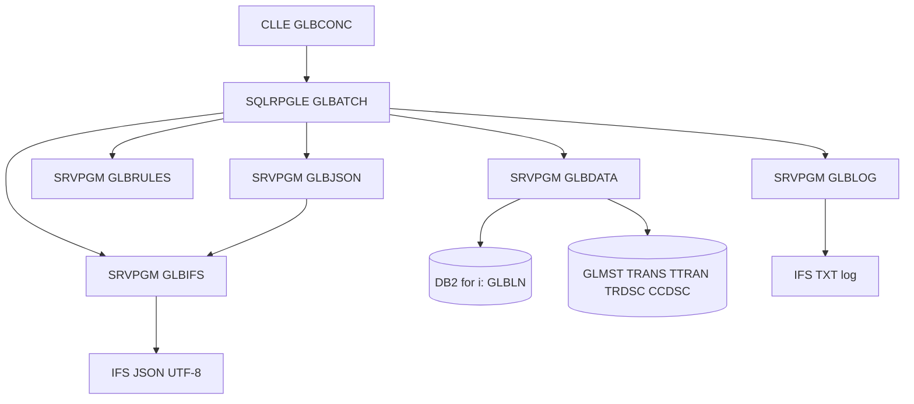

# 03 - Arquitectura IBM i

## Vista general

La solucion se implementa como proceso batch IBM i. Un programa CLLE recibe
parametros, prepara el entorno y llama a un programa SQLRPGLE orquestador. El
orquestador delega lectura de datos, reglas de negocio, generacion JSON,
escritura IFS y logging en modulos separados y programas de servicio.



## Componentes

| Componente | Tipo | Responsabilidad |
|---|---|---|
| `GLBCONC` | CLLE | Entrada batch, parametros, job log y llamada principal. |
| `GLBATCH` | SQLRPGLE | Orquestacion de la corrida y control de estado. |
| `GLBDATA` | Service program | Acceso DB2 for i y cursores SQL. |
| `GLBRULES` | Service program | Calculos, tolerancia, estados e incidentes. |
| `GLBJSON` | Service program | Construccion JSON con funciones SQL Db2 for i. |
| `GLBIFS` | Service program | Escritura IFS con funciones SQL Db2 for i. |
| `GLBLOG` | Service program | Bitacora TXT y eventos de auditoria. |
| `V_GLBLN_CTX` | SQL View | Vista de cuentas `GLBLN` filtrables y enriquecidas. |
| `V_GL_MOVS` | SQL View | Vista de movimientos `TRANS` y `TTRAN` normalizados. |

`V_GLBLN_CTX` y `V_GL_MOVS` son entregables obligatorios. Deben construirse
como vistas SQL, documentarse con metadata, comentarios y labels conforme a
`Revision_IBMi.md`, y no pueden reemplazarse por PF, LF ni DDS.

Tambien son entregables obligatorios los DDL SQL de las tablas utilizadas por el
proceso: `GLBLN`, `GLMST`, `TRANS`, `TTRAN`, `TRDSC` y `CCDSC`. En este
documento: nombre logico, nombre fisico IBM i, tipo, longitud, decimales, uso, obligatoriedad,
origen, clave, indices esperados, reglas de nulos y observaciones. Cada DDL SQL debe cumplir los estandares de documentacion, trazabilidad y revision definidos
en `Revision_IBMi.md`.

## Responsabilidades por capa

### Entrada batch

`GLBCONC`:

- Recibe parametros desde comando, scheduler o llamada manual.
- Valida presencia basica de parametros obligatorios.
- Establece librerias y ambiente de ejecucion.
- Invoca `GLBATCH`.
- Retorna codigo de finalizacion.

### Orquestacion

`GLBATCH`:

- Genera `idEjecucion`.
- Inicializa bitacora.
- Valida parametros con reglas completas.
- Solicita cuentas a `GLBDATA`.
- Itera cuentas y delega calculos a `GLBRULES`.
- Acumula cuentas, incidentes y control de totales.
- Invoca construccion JSON.
- Solicita escritura IFS.
- Determina estado final.

### Datos

`GLBDATA`:

- Expone procedimientos de lectura por contrato.
- Consulta `GLBLN` con filtros.
- Enriquece datos desde `GLMST` si existe relacion.
- Consulta movimientos desde `TRANS` y `TTRAN`.
- Consulta textos desde `TRDSC`.
- No contiene reglas de negocio.

### Reglas

`GLBRULES`:

- Calcula saldo comparativo.
- Calcula diferencias.
- Evalua tolerancia.
- Determina estado financiero.
- Determina estado de conciliacion.
- Clasifica severidades.
- Construye incidentes funcionales por cuenta.
- No accede a IFS ni escribe logs directamente.

### JSON

`GLBJSON`:

- Recibe estructuras ya calculadas.
- Construye el JSON mediante funciones SQL Db2 for i.
- Construye secciones `metadata`, `ejecucion`, `contexto`, `cuentas`,
  `controlTotales` e `incidentes`.
- Usa `JSON_OBJECT`, `JSON_ARRAYAGG` y `FORMAT JSON` para objetos anidados.
- Usa `JSON_TABLE` para validacion formal o lectura de prueba del JSON final.
- Entrega el contenido como `CLOB`.

### IFS

`GLBIFS`:

- Valida existencia y permisos de la ruta.
- Escribe primero a archivo temporal usando funciones SQL Db2 for i.
- Cierra el stream file.
- Renombra a nombre final solo si la escritura termina bien.
- Reporta errores tecnicos al orquestador.
- Usa `IFS_WRITE_UTF8` para crear y grabar el JSON UTF-8 en IFS.

### Logging

`GLBLOG`:

- Abre y cierra bitacora TXT por ejecucion.
- Registra lineas normalizadas.
- No decide si el proceso continua o aborta.
- No mezcla mensajes funcionales con reglas de negocio.

## Flujo batch

1. `GLBCONC` recibe parametros.
2. `GLBCONC` llama a `GLBATCH`.
3. `GLBATCH` genera `idEjecucion` y nombre base de archivos.
4. `GLBLOG` registra `INICIO`.
5. `GLBATCH` valida parametros.
6. `GLBDATA` abre cursor de cuentas desde `GLBLN`.
7. Por cada cuenta:
   - Lee datos maestros.
   - Lee movimientos historicos y del dia.
   - Calcula saldos y diferencias.
   - Determina estados.
   - Registra incidentes por cuenta si aplica.
   - Acumula totales.
8. `GLBJSON` construye el documento JSON con funciones SQL Db2 for i.
9. `GLBJSON` valida sintaxis formal y codificacion UTF-8.
10. `GLBIFS` escribe archivo temporal en IFS.
11. `GLBIFS` renombra archivo temporal al nombre final.
12. `GLBATCH` determina estado final.
13. `GLBLOG` registra `FIN`.
14. `GLBCONC` retorna resultado al scheduler o usuario.

## Dependencias

| Componente | Depende de |
|---|---|
| `GLBCONC` | `GLBATCH` |
| `GLBATCH` | `GLBDATA`, `GLBRULES`, `GLBJSON`, `GLBIFS`, `GLBLOG` |
| `GLBDATA` | DB2 for i, vistas SQL, tablas fuente |
| `GLBRULES` | Contratos de datos normalizados |
| `GLBJSON` | Contrato de salida y estructuras de negocio |
| `GLBIFS` | IFS y permisos de perfil de ejecucion |
| `GLBLOG` | IFS y formato de bitacora |

La dependencia apunta hacia contratos estables. El negocio no depende de SQL ni
de IFS; el orquestador coordina pero no concentra reglas.

## Contratos entre componentes

### Entrada de ejecucion

```text
RunParms
  codigoBanco       char/varchar
  codigoSucursal    char/varchar opcional
  codigoMoneda      char/varchar opcional
  cuentaDesde       char/varchar opcional
  cuentaHasta       char/varchar opcional
  fechaProceso      date
  rutaIfs           varchar
  modoEjecucion     char/varchar
  ambiente          char/varchar
  tolerancia        packed decimal(18,2)
```

### Cuenta fuente normalizada

```text
CuentaFuente
  codigoBanco
  codigoSucursal
  codigoMoneda
  cuentaContable
  descripcionCuenta
  naturalezaCuenta
  nivelCuenta
  centroCosto
  saldoFuente
  fechaProcesoSistema
```

### Movimiento normalizado

```text
Movimiento
  idMovimiento
  numeroRegistroRelativo
  fechaOperacion
  tipoMovimiento
  debitoCredito
  monto
  referenciaExterna
  textoDescripcion
```

### Resultado por cuenta

```text
CuentaResultado
  cuentaFuente
  totalDebitos
  totalCreditos
  cantidadMovimientos
  saldoCalculado
  saldoConciliado
  diferenciaNeta
  excedeTolerancia
  requiereRevision
  estadoFinanciero
  estadoConciliacion
  incidentesCuenta
  partidasConciliatorias
```

### Resultado de operacion

Todo procedimiento publico debe retornar un contrato de estado:

```text
OpStatus
  ok              indicator
  severidad       char/varchar
  codigo          char/varchar
  mensaje         varchar
```

El llamador decide continuar o abortar segun el contexto.

## Contratos por servicio

Todos los procedimientos exportados reciben estructuras normalizadas y retornan
`OpStatus` como primer mecanismo de control. Cuando un procedimiento necesita
devolver datos, los entrega en parametros de salida definidos por ownership.

### Ownership de estructuras

| Estructura | Owner | Consumidores |
|---|---|---|
| `RunParms` | `GLBATCH` | Todos los servicios. |
| `CuentaFuente` | `GLBDATA` | `GLBRULES`, `GLBJSON`. |
| `Movimiento` | `GLBDATA` | `GLBRULES`, `GLBJSON`. |
| `CuentaResultado` | `GLBRULES` | `GLBATCH`, `GLBJSON`. |
| `Incidente` | `GLBRULES` | `GLBATCH`, `GLBJSON`, `GLBLOG`. |
| `ControlTotales` | `GLBATCH` | `GLBJSON`, `GLBRULES`. |
| `JsonDoc` | `GLBJSON` | `GLBATCH`, `GLBIFS`. |
| `LogEvent` | `GLBLOG` | `GLBATCH`. |
| `OpStatus` | Contrato comun | Todos los servicios. |

Solo el owner puede cambiar la forma interna de una estructura. Los consumidores
dependen del contrato versionado, no de campos fisicos de DB2 for i.

### `GLBDATA`

| Procedimiento exportado | Parametros | Retorno | Errores posibles |
|---|---|---|---|
| `openCuentaCursor` | `RunParms`, cursor out | `OpStatus` | Parametros SQL invalidos, fuente no disponible, autoridad insuficiente. |
| `fetchCuenta` | cursor, `CuentaFuente` out, eof out | `OpStatus` | Error de lectura, dato obligatorio nulo, conversion de tipo. |
| `loadMovimientos` | `CuentaFuente`, `RunParms`, lista `Movimiento` out | `OpStatus` | `TRANS`/`TTRAN` no disponible, timeout, datos inconsistentes. |
| `loadDescripciones` | lista `Movimiento` in/out | `OpStatus` | `TRDSC` no disponible, descripcion incompleta. |
| `closeCuentaCursor` | cursor | `OpStatus` | Cursor ya cerrado, error SQL al cerrar. |

`GLBDATA` es owner de `CuentaFuente` y `Movimiento`. No calcula estados ni
decide severidades funcionales.

### `GLBRULES`

| Procedimiento exportado | Parametros | Retorno | Errores posibles |
|---|---|---|---|
| `calcSaldoCuenta` | `CuentaFuente`, lista `Movimiento`, `CuentaResultado` out | `OpStatus` | Movimiento con signo invalido, monto nulo, overflow decimal. |
| `evalTolerancia` | `CuentaResultado` in/out, tolerancia | `OpStatus` | Tolerancia negativa, diferencia no calculada. |
| `dispatchReglas` | versionContrato, contexto, `CuentaResultado` in/out | `OpStatus` | Regla inexistente, regla inactiva, version no soportada. |
| `clasificaEstado` | `CuentaResultado` in/out | `OpStatus` | Catalogo de estado no valido, severidad desconocida. |
| `buildIncidentesCuenta` | `CuentaResultado`, lista `Incidente` out | `OpStatus` | Incidente duplicado, codigo no catalogado. |

`GLBRULES` es owner de `CuentaResultado` e `Incidente`. No accede a SQL, IFS
ni bitacora fisica.

### `GLBJSON`

| Procedimiento exportado | Parametros | Retorno | Errores posibles |
|---|---|---|---|
| `buildJson` | `RunParms`, ejecucion, cuentas, control, incidentes, `JsonDoc` out | `OpStatus` | Campo obligatorio ausente, error de escape, limite de tamano. |
| `validateJsonSyntax` | `JsonDoc` | `OpStatus` | JSON no parseable por Db2, arreglo invalido, estructura incompleta. |
| `validateUtf8` | `JsonDoc` | `OpStatus` | Caracter no convertible, byte invalido, encoding distinto a UTF-8. |
| `validateControlTotales` | cuentas, control | `OpStatus` | Conteo inconsistente, suma de diferencias no cuadra. |

`GLBJSON` es owner de `JsonDoc`. No calcula reglas contables y no escribe
directamente en IFS. La construccion debe seguir el patron documentado en
`docs/Codigo_Ejemplos/EjemploJSON.sql` y
`docs/Codigo_Ejemplos/PracticaJSON.sql`.

### `GLBIFS`

| Procedimiento exportado | Parametros | Retorno | Errores posibles |
|---|---|---|---|
| `validatePath` | ruta IFS | `OpStatus` | Ruta inexistente, permisos insuficientes, no es directorio. |
| `writeTempFile` | ruta, nombre temporal, `JsonDoc` | `OpStatus` | Error `IFS_WRITE_UTF8`, error de escritura, espacio insuficiente. |
| `publishFile` | nombre temporal, nombre final | `OpStatus` | Rename fallido, archivo final existente, bloqueo IFS. |
| `cleanupTempFile` | nombre temporal | `OpStatus` | Archivo no encontrado, permisos insuficientes. |

`GLBIFS` es owner de la publicacion fisica. Solo recibe documentos ya
validados. La escritura debe seguir el patron documentado en
`docs/Codigo_Ejemplos/GrabaIFS.sql`, usando `IFS_WRITE_UTF8` desde SQL Db2
for i.

### `GLBLOG`

| Procedimiento exportado | Parametros | Retorno | Errores posibles |
|---|---|---|---|
| `openLog` | ruta, nombre log, idEjecucion | `OpStatus` | Ruta invalida, permisos insuficientes. |
| `writeEvent` | `LogEvent` | `OpStatus` | Log no abierto, error de escritura, mensaje truncado. |
| `closeLog` | idEjecucion | `OpStatus` | Error al cerrar stream file. |

`GLBLOG` es owner de `LogEvent` y del formato TXT. No decide continuidad del
batch.

### `GLBATCH`

| Procedimiento exportado | Parametros | Retorno | Errores posibles |
|---|---|---|---|
| `runBatch` | `RunParms` | `OpStatus` | Error global, estado final `ERROR`, dependencia no disponible. |
| `validaParametros` | `RunParms` | `OpStatus` | Obligatorio ausente, rango invalido, tolerancia invalida. |
| `determinaEstadoFinal` | control, incidentes, estado out | `OpStatus` | Severidad desconocida, totales no consistentes. |

`GLBATCH` es owner de la ejecucion y de `ControlTotales`.

## Patron de extension de reglas

Las reglas de conciliacion y clasificacion se extienden sin modificar acceso a
datos, JSON, IFS ni logging. El patron obligatorio es:

1. Cada regla vive en un procedimiento independiente de `GLBRULES`.
2. Cada procedimiento recibe contexto y `CuentaResultado` y retorna `OpStatus`.
3. `dispatchReglas` ejecuta las reglas activas en orden controlado.
4. El dispatcher usa un contrato versionado por `versionContrato`.
5. Las reglas activas se leen desde una configuracion SQL o constante
   versionada, segun disponibilidad del ambiente.
6. Toda nueva regla debe tener prueba unitaria y escenario de mock data.

Configuracion sugerida de reglas:

```text
ReglaConfig
  versionContrato
  codigoRegla
  nombreProcedimiento
  ordenEjecucion
  activa
  severidadDefault
```

Si se implementa como tabla SQL, el script debe cumplir el estandar completo de
`Revision_IBMi.md`. Si se implementa como constante versionada en RPGLE para el
taller, debe documentarse el mismo contrato y quedar lista para migracion a
tabla SQL sin cambiar los consumidores.

## Estrategia de logging

- El log principal es TXT en IFS, uno por ejecucion.
- Formato: `timestamp|idEjecucion|etapa|severidad|codigo|mensaje`.
- El orquestador registra cambios de etapa.
- Los programas de servicio retornan `OpStatus`; `GLBATCH` centraliza la
  escritura para mantener orden y trazabilidad.
- Los incidentes funcionales tambien se agregan al JSON.
- Errores no recuperables se registran antes de cerrar la ejecucion.

## Estrategia JSON

- Generar un unico JSON por corrida.
- Construir el documento por secciones con funciones SQL Db2 for i.
- Usar `JSON_OBJECT` para objetos, `JSON_ARRAYAGG` para arreglos y
  `FORMAT JSON` para incluir subdocumentos anidados ya generados.
- Dejar el escapado de cadenas, nulos, numeros y booleanos a las funciones
  JSON nativas de Db2 for i.
- Usar expresiones SQL o CTE para componer subdocumentos de cuentas,
  partidas, incidentes y totales.
- Emitir UTF-8 al escribir en IFS.
- Validar como minimo:
  - parseo del documento final mediante funcion SQL Db2 for i;
  - lectura de prueba con `JSON_TABLE` para secciones criticas;
  - presencia de secciones obligatorias;
  - cuadre de `controlTotales`.
- Ejecutar validacion formal del JSON final antes de publicar:
  - `validateJsonSyntax` para sintaxis JSON completa;
  - `validateUtf8` para confirmar codificacion UTF-8 del contenido final;
  - `validateControlTotales` para recalcular conteos y sumas desde el detalle;
  - comparacion automatica entre `controlTotales` y acumulados de `cuentas`.
- Registrar en bitacora el resultado de cada validacion formal.
- Si la validacion falla, no publicar el archivo final.

El cuadre automatico de `controlTotales` debe recalcular, como minimo,
`totalCuentasLeidas`, `totalCuentasExportadas`, `totalCuentasConDiferencia`,
`totalCuentasConRevision`, `sumatoriaSaldoFuente`,
`sumatoriaSaldoCalculado`, `sumatoriaSaldoConciliado`,
`sumatoriaDiferenciaNeta` y `totalIncidentes`.

Ejemplo de patron SQL esperado:

```sql
SELECT JSON_OBJECT(
         KEY 'metadata' VALUE metadata_json FORMAT JSON,
         KEY 'cuentas' VALUE cuentas_json FORMAT JSON,
         KEY 'controlTotales' VALUE control_json FORMAT JSON,
         KEY 'incidentes' VALUE incidentes_json FORMAT JSON
       )
  FROM ...
```

La arquitectura no permite concatenar manualmente cadenas para formar el JSON
salvo casos puntuales justificados y cubiertos por prueba de validacion formal.

## Estrategia IFS con SQL Db2

- La escritura en IFS debe hacerse con funciones SQL Db2 for i.
- El procedimiento principal de escritura es `IFS_WRITE_UTF8`.
- Primero se crea o reemplaza el archivo temporal con linea vacia y
  `OVERWRITE => 'REPLACE'`.
- Luego se escribe el `CLOB` JSON final en UTF-8.
- La publicacion final solo ocurre si la escritura temporal y la validacion
  posterior son correctas.
- El patron de referencia es `docs/Codigo_Ejemplos/GrabaIFS.sql`.

Ejemplo de patron SQL esperado:

```sql
CALL IFS_WRITE_UTF8(
  PATH_NAME => ruta_temporal,
  LINE => '',
  OVERWRITE => 'REPLACE',
  END_OF_LINE => 'NONE'
);

CALL IFS_WRITE_UTF8(
  PATH_NAME => ruta_temporal,
  LINE => json_clob
);
```

## Estrategia de errores

| Tipo de error | Accion |
|---|---|
| Parametro invalido | Abortar con estado `ERROR`. |
| Ruta IFS no disponible | Abortar con estado `ERROR`. |
| Lectura global `GLBLN` falla | Abortar con estado `ERROR`. |
| Cuenta con datos incompletos | Registrar incidente y continuar. |
| Movimiento no disponible | Registrar incidente y continuar. |
| Enriquecimiento no disponible | Continuar con campos nulos controlados. |
| Diferencia fuera de tolerancia | Continuar y marcar revision. |
| JSON invalido | Abortar antes de publicar. |
| Escritura IFS fallida | Abortar y conservar log. |

## Estrategia de pruebas

Todas las pruebas deben usar mock data consistente para cada tabla utilizada:
`GLBLN`, `GLMST`, `TRANS`, `TTRAN`, `TRDSC` y `CCDSC`. Los datos mock deben
mantener claves compatibles entre tablas, saldos y movimientos conciliables,
movimientos no conciliables, cuentas sin movimientos, cuentas con saldo cero,
datos maestros faltantes, descripciones faltantes e incidentes tecnicos
simulados. La evidencia de pruebas debe indicar el escenario, las filas mock
usadas y el resultado esperado.

### Pruebas unitarias

- Calculo de saldo con debitos y creditos.
- Diferencia neta y tolerancia.
- Estado financiero.
- Estado de conciliacion.
- Clasificacion de severidad.
- Validacion del escapado JSON generado por funciones Db2 for i.

### Pruebas de integracion

- Lectura de `GLBLN` con filtros.
- Enriquecimiento con `GLMST`.
- Union de movimientos `TRANS` y `TTRAN`.
- Generacion de archivo JSON en ruta IFS de prueba.
- Generacion de bitacora TXT.
- Uso de mock data consistente en todas las tablas fuente.

### Pruebas de contrato JSON

- JSON valido y UTF-8.
- Secciones obligatorias presentes.
- Una cuenta exportada por cada cuenta procesada valida.
- `controlTotales` consistente contra detalle.
- Incidentes `ALTA` o `CRITICA` afectan estado final.
- Validacion formal de sintaxis, UTF-8 y cuadre automatico.

### Escenarios minimos de mock data

| Escenario | Datos requeridos | Resultado esperado |
|---|---|---|
| Cuenta conciliada | `GLBLN` + `GLMST` + movimientos balanceados | `CONCILIADA`, `NORMAL`. |
| Fuera de tolerancia | Saldo fuente distinto a movimientos | `PARCIAL`, `OBSERVADO`, revision. |
| Sin movimientos | Cuenta en `GLBLN` sin `TRANS`/`TTRAN` | Exportada con resumen en cero. |
| Saldo cero | Cuenta en `GLBLN` con saldo 0.00 | Exportada y controlada en totales. |
| Maestro faltante | `GLBLN` sin match en `GLMST` | Campo nulo e incidente no fatal. |
| Descripcion faltante | Movimiento sin `TRDSC` | Movimiento exportable con observacion. |
| Centro costo opcional | Cuenta sin match en `CCDSC` | Centro costo nulo controlado. |
| Error por cuenta | Dato invalido en una cuenta | Cuenta `NO_PROCESADA` y continua. |
| Error global | Ruta IFS invalida o `GLBLN` no disponible | Estado final `ERROR`. |

### Pruebas de rendimiento

- Ejecucion incremental por rangos de cuenta.
- Medicion de tiempo total, cuentas procesadas y tamano de archivo.
- Validacion de memoria usada al construir JSON.
- Revision de indices sobre campos de filtro y fecha.

## Aplicacion de SOLID

| Principio | Aplicacion |
|---|---|
| SRP | Cada componente tiene una responsabilidad unica. |
| OCP | Nuevas reglas se agregan en `GLBRULES` sin tocar IFS o SQL. |
| LSP | Procedimientos de datos pueden cambiar de vista sin romper contrato. |
| ISP | Contratos separados para parametros, cuentas, movimientos y estado. |
| DIP | Negocio depende de estructuras normalizadas, no de tablas ni archivos. |

## Convenciones de nombres

| Objeto | Convencion |
|---|---|
| CLLE principal | `GLBCONC` |
| SQLRPGLE batch | `GLBATCH` |
| Programas de servicio | Prefijo `GLB` y sufijo funcional. |
| Vistas SQL | Prefijo `V_` y nombre funcional. |
| JSON IFS | `CONCILIACION_GLBLN_YYYYMMDD_HHMMSS_IDEJECUCION.json` |
| Log IFS | `CONCILIACION_GLBLN_YYYYMMDD_HHMMSS_IDEJECUCION.log` |

Si se crean tablas SQL de apoyo en fases posteriores, cada script debe cumplir
la metadata obligatoria, comentarios, labels, `FOR COLUMN`, `PRIMARY KEY` y
`RCDFMT` definidos por la guia de revision.

## Entregables tecnicos

| Entregable | Descripcion | Estandar obligatorio |
|---|---|---|
| `V_GLBLN_CTX.sql` | Vista SQL de cuentas `GLBLN` filtrables y enriquecidas. | `Revision_IBMi.md`, comentarios, labels y lineas SQL hasta 80 caracteres. |
| `V_GL_MOVS.sql` | Vista SQL de movimientos normalizados desde `TRANS` y `TTRAN`. | `Revision_IBMi.md`, comentarios, labels y lineas SQL hasta 80 caracteres. |
| DDL SQL `GLBLN` | Definicion y mapeo de balances generales. | Campos, claves, tipos, origen, uso y reglas de nulos. |
| DDL SQL `GLMST` | Definicion y mapeo de maestro contable. | Campos, claves, tipos, origen, uso y reglas de nulos. |
| DDL SQL `TRANS` | Definicion y mapeo de historico de transacciones. | Campos, claves, tipos, origen, uso y reglas de nulos. |
| DDL SQL `TTRAN` | Definicion y mapeo de transacciones del dia. | Campos, claves, tipos, origen, uso y reglas de nulos. |
| DDL SQL `TRDSC` | Definicion y mapeo de descripciones de transacciones. | Campos, claves, tipos, origen, uso y reglas de nulos. |
| DDL SQL `CCDSC` | Definicion y mapeo de centros de costo. | Campos, claves, tipos, origen, uso y reglas de nulos. |
| Mock data | Scripts o dataset documentado para pruebas. | Consistencia referencial y cobertura de escenarios minimos. |

## Controles de cumplimiento

- No se usan tecnologias fuera del alcance IBM i.
- No se propone crear PF, LF ni DDS.
- Los componentes separan datos, negocio, JSON, IFS y logging.
- El flujo tiene id de ejecucion de punta a punta.
- El JSON publica metadata, ejecucion, contexto, cuentas, control e incidentes.
- Los errores por severidad afectan estado final de forma trazable.
- Las pruebas cubren reglas, integracion, JSON y rendimiento incremental.
